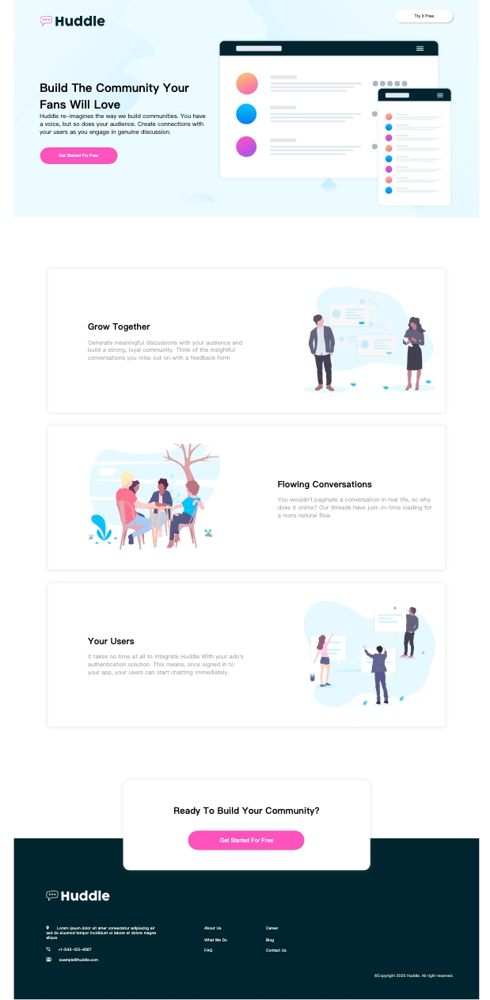

# Huddle Landing Page

A beginner-level landing page built to practice layout structure and visual balance using HTML and CSS.

## 🌐 Live Demo  
[👉 View Online](https://vanta-zjm.github.io/huddle-landing-page/index.html)

## 📸 Preview  

## 🛠️ Built With
- HTML5
- CSS3
- Google Fonts
- Semantic layout structure

## ✨ Key Features
- ✅ Clear image-text layout
- ✅ Button styling and hover effects
- ✅ Font pairing for visual hierarchy
- ✅ Mobile responsiveness

## 💡 What I Learned
- Building from reference designs
- Practicing layout precision with simple content
- Understanding element alignment and whitespace usage
- Gaining confidence with structure and styling basics

## 📄 License
MIT
